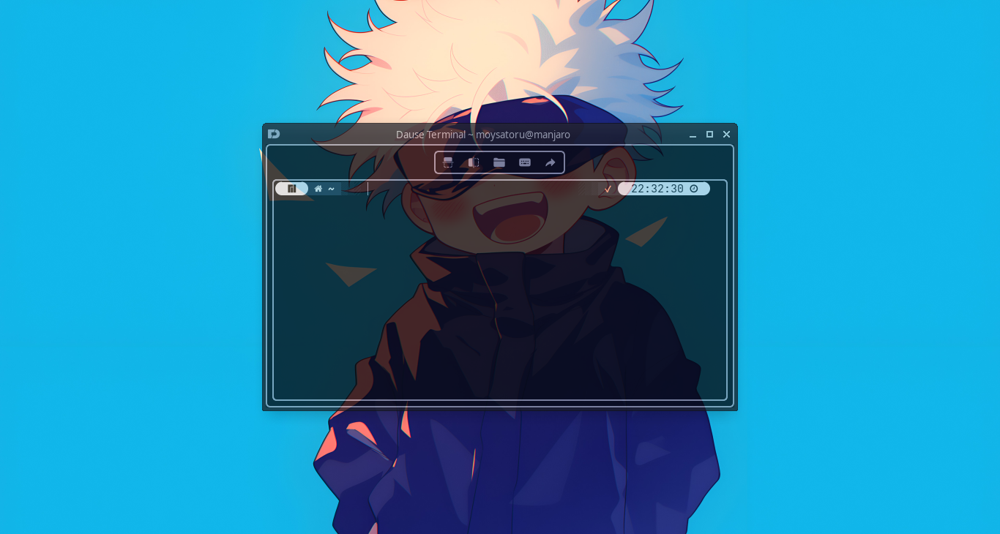
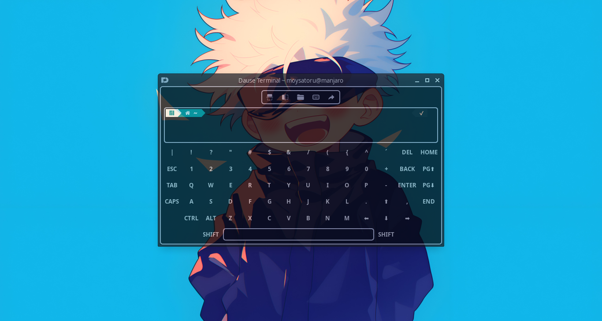
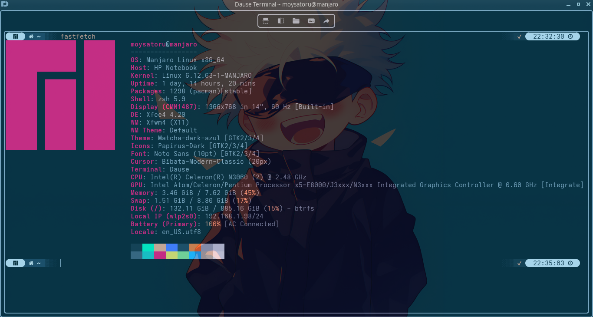
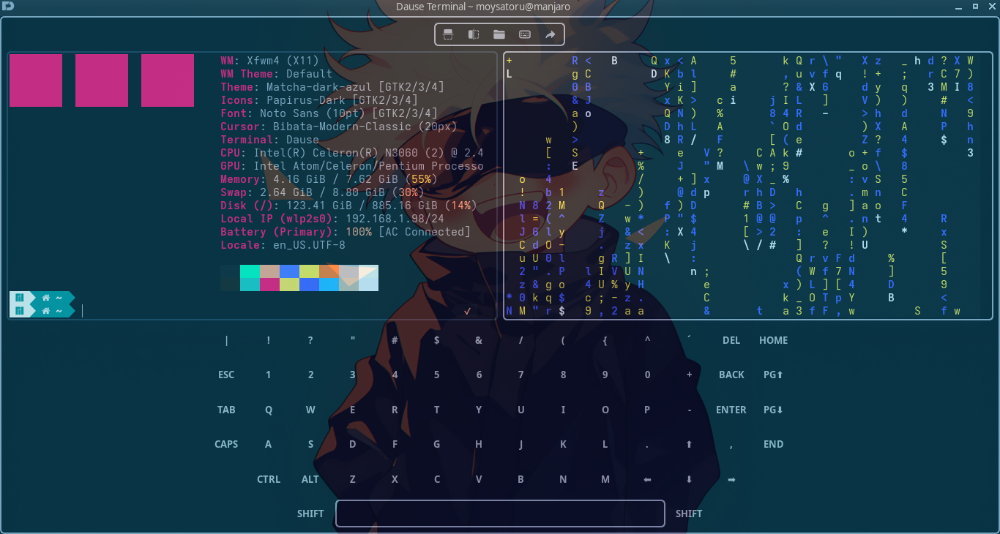
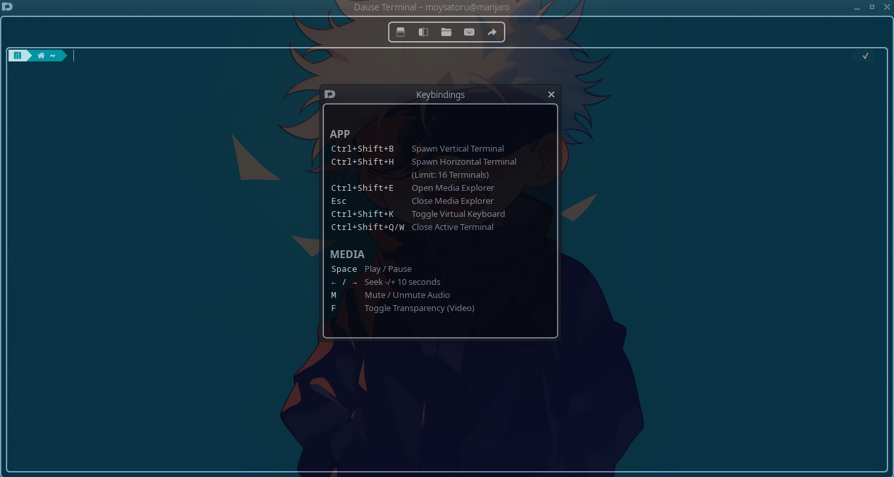
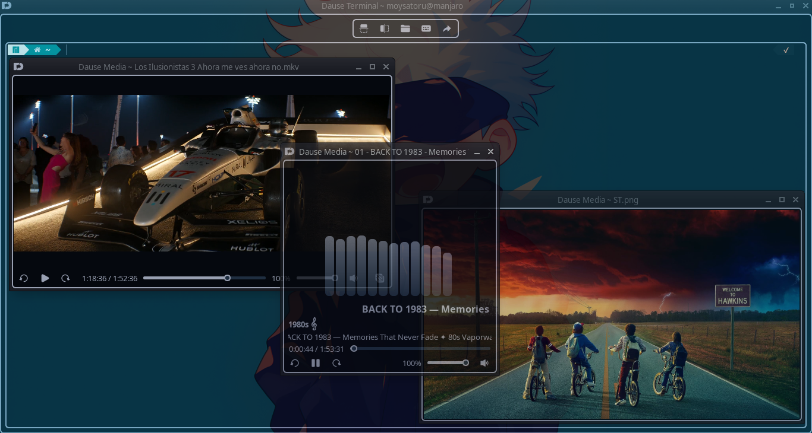

<p align="center">
  
</p>
<p align="center">Retro-Futuristic Terminal Emulator Built for Arch and Beyond</p>

# D.A.U.S.E.   
**Digital Amplified User System Environment** is a retro-futuristic, minimalist terminal emulator purpose-built for **Arch Linux**. It blends the raw aesthetic of vintage computing with high-performance modern features, including a virtual terminal, media visualization and a robust parallel tab system.  

*DAUSE is optimized specifically for the **ZSH** shell environment, ensuring seamless command execution and styling for power users.*

## Features  
* **Arch Native**: Designed with the Arch Linux philosophy of simplicity and user-centricity.
* **ZSH Optimized**: Tailored to work out-of-the-box with ZSH workflows.
* **Touch-First Input**: A reimagined virtual keyboard engineered specifically for touch devices.
* **Media Amplified**: Built-in integration for media visualization and playback (FFmpeg & FFTW).
* **Parallel Workflow**: Spawn and manage multiple parallel tabs for complex multitasking.
* **Retro-Modern UI**: A minimalist, distraction-free interface with a classic digital vibe.

## Interface  
<div style="display: flex; overflow-x: auto; gap: 9px; padding: 0px; white-space: nowrap;">
  
  
  
  
  
  
</div>

## Dependencies  
### Framework  
**Qt 6**  
`sudo pacman -S qt6-base qt6-tools`

### Terminal Backend  
**QTermWidget**  
`sudo pamac build qtermwidget-git`  

### Media & Signal Processing  
**QMediaPlayer** (FFmpeg Option)  
`sudo pacman -S qt6-multimedia`  

**FFTW**  
`sudo pacman -S fftw`  

**FFmpeg**  
`sudo pacman -S ffmpeg`  

## Installation 
### Arch Linux
Dause is available in the Arch User Repository (AUR). You can install it using any AUR helper:  
`pamac build dause` (or use the **Add/Remove Software** GUI)  
`yay -S dause`  
`paru -S dause`  

If you don't have an AUR helper, you can build it manually:  
```bash
git clone https://aur.archlinux.org/dause.git
cd dause
makepkg -si
```

### General Linux (Building from Source)  
Use this method if you want to contribute to development or are using a non-Arch distribution.  
**Dependencies**: Ensure you have the following installed:
* **cmake**
* **ffmpeg**
* **fftw**
* **qt6-multimedia**
* **qtermwidget**

Build steps:  
```bash
# Clone the repository
git clone https://github.com/moyhatake/Dause.git
cd Dause

# Create build directory
mkdir build && cd build

# Configure and build (Release mode recommended)
cmake -DCMAKE_BUILD_TYPE=Release ..
make -j$(nproc)

# Run the application
./Dause
```

## Shell Configuration (Optional)
If the Delete key on your physical keyboard removes entire words instead of single characters, add these lines to the bottom of your **~/.zshrc**:  
```
bindkey '^?' backward-delete-char  
bindkey '^H' backward-delete-char
```  